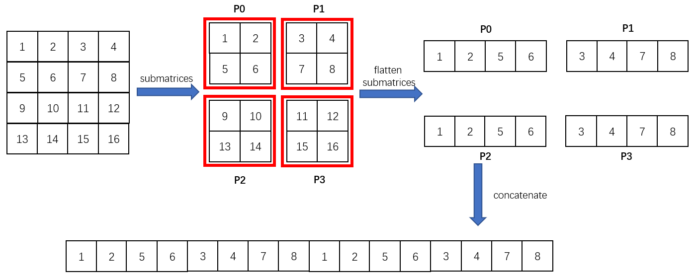
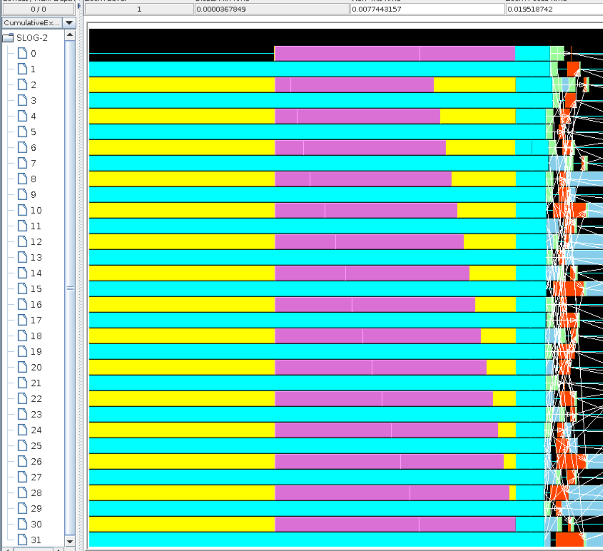
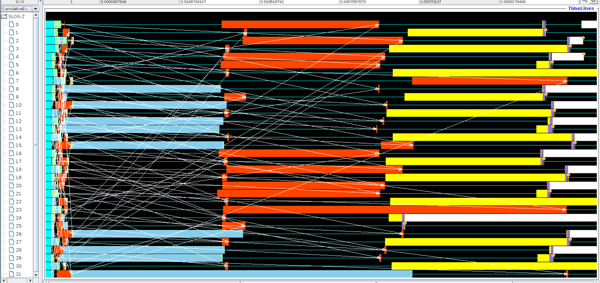
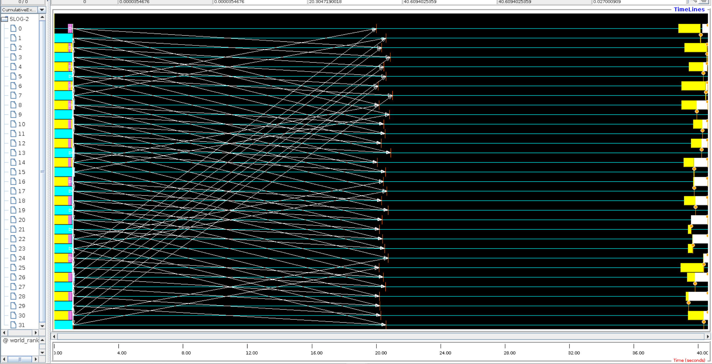
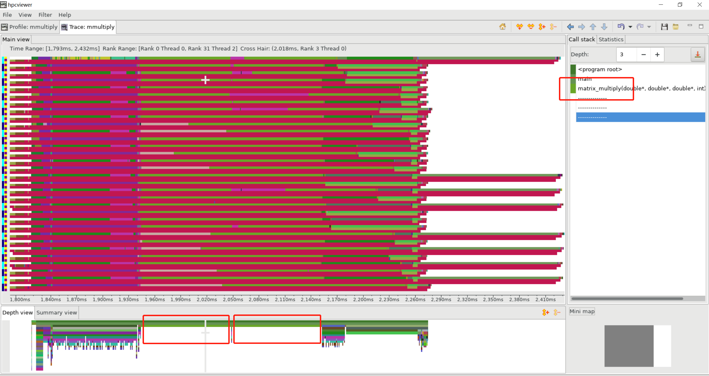
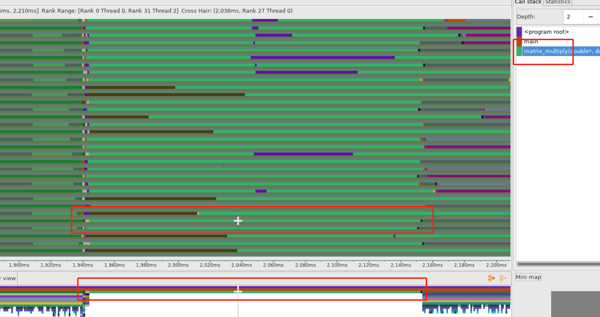

# Assignment 3 - 2.5D Matrix Multiplication using MPI

Name : Tianxing Wang                                                                     

NetID : tw44

## Project Files

```
root directory
	├── utils.h .cpp
	├── mmultiply.cpp        // Main function
	├── compile.sh           // compile program
	├── submit.sbatch        // compile and submit to compute node
	├── hpcgenerate.sh       // generate hpc dataset and launch hpcviewer
	└── Makefile             // Makefile
```


## Algorithm

This project implements the 2.5D matrix multiplication algorithm presented in the [paper](http://www.eecs.berkeley.edu/Pubs/TechRpts/2011/EECS-2011-10.pdf). This algorithm combines the 3D matrix production algorithm and the Cannon algorithm. By duplicating the matrix on each plane along the Z direction (with the size of `c`) to reduce the complexity.

### Bandwidth and Latency Lower Bounds

In the alignment step, the algorithm first shifts the matrix `A` and `B` based on the index of the plane in the Z direction. The bandwidth cost `W` and latency cost `S` are $ W=\Omega(\frac{n^2}{\sqrt{p*c}}) $ and $ S=\Omega(\sqrt\frac{p}{c^3}) $ . 

In the corner case where `c=1`, the algorithm degrade to a normal cannon algorithm with high bandwidth cost and latency cost. In the Z direction extension of matrix replication, use more memory to leverage the communication cost since the loop steps reduced from $ \sqrt{p} $ to $ \sqrt{\frac{p}{c^3}} $.

## Implementation

I flatten the 2D matrix into an array for MPI-friendly data formating. In the example of the picture below:



the matrix size of `A`,`B` and `C` is `4*4` and 4 MPI processes on each plane. The submatrices should be distributed to 4 processes as divided by the red grid. Flatten the submatrices into array respectively as the `local_A`(or `local_B`, `local_C`). 

First allocate matrix `A` and `B` on `rank==0`, both matrices presented in flattened array format. Then distributed into submatrices on the plane where `k==0`. In the example of the picture, the command should be:

```
MPI_Scatter(A, 4, MPI_DOUBLE, local_A_buffer, 4, MPI_DOUBLE, root_rank, plane_comm); 
```

After distributed submatrices on the front plane processers, broadcast the matrix plane along the z-direction, namely each Z's plane has the same distribution of matrix `A` and `B`.

```
MPI_Bcast(local_A_buffer, 4, MPI_DOUBLE, 0, z_comm);
```

Now for each Z plane, a process has one submatrix of `A` and `B` storing at local variable array `local_A_buffer` and `local_B_buffer`. Then in the alignment initialization step, send and receive the submatrix into local variable array `local_A` and `local_B`. In the main loop of cannon algorithm, I use the variable pair `local_A_buffer` and `local_B_buffer`to nonblocking send & receive data, while doing matrix multiplication on `local_A` and `local_B`, then swap pointers:

```c++
for (..) {
        MPI_Isend local_A and local_B;
        MPI_Irecv local_A_buffer and local_B_buffer;

        local_C += matrix_multiply(local_A, local_B);
        
        MPI_Waitall;

        std::swap(local_A, local_A_buffer);
        std::swap(local_B, local_B_buffer);
}
local_C += matrix_multiply(local_A, local_B);
```


## Experiment

### Parameter Configuration

Record the hyperparameter and collapse time in the table below. When configuring the hyperparameter of total processors number `P` and the Z dimension size `c`, restrained by the following constrains:

$$
\ \frac{P}{c} ,\sqrt{\frac{P}{c^3} },\frac{n \times c}{P} \in \real
$$

In the experiment, I set the `n=7560` as one post mentioned on Piazza, because it is a more common multiple compared to `7500`.

| P    | Plane Processors | C    | Collapse Time(s) |
| ---- | ---------------- | ---- | ---------------- |
| 4    | 2 * 2 = 4        | 1    | 308.7            |
| 9    | 3 * 3 = 9        | 1    | 104.9            |
| 8    | 2 * 2 = 4        | 2    | 153.7            |
| 32   | 4 * 4 = 16       | 2    | 44.1             |
| 72   | 6 * 6 = 36       | 2    | 32.9             |
| 128  | 8 * 8 = 64       | 2    | 36.7             |
| 27   | 3 * 3 = 9        | 3    | 38.4             |
| 108  | 6 * 6 = 36       | 3    | 21.2             |
| 64   | 4 * 4 = 16       | 4    | 25.0             |
| 125  | 5 * 5 = 25       | 5    | 18.0             |


### Collective Communication

I use collective communication in several places. In the distribution of matrix `A` and `B`, I first generate them on root rank, then **Scatter** each submatrix on the plane. To make a replica on each plane, I **Broadcast** the data from the front plane to all the planes along the Z direction. In the verification part, at last, sum **Reduce** along Z direction to get the result `C` matrix on the front plane, then **Gather** the submatrices of `C` to root rank.

### Jumpshot

`P=4*4*2=32` with `c=2`, first set `n=756` to have a close look at each steps:



In the picture, root rank first generates matrix `A` and `B`, then Scatter to the front plane where only the even ranks are shown. Then the front plane broadcasts to the second plane whose ranks are odd. After the broadcast is finished, the program goes to the cannon algorithm part.



The program will go through the main loop once, so there are two unblocking message sending, which is presented in the picture where two groups of red blocks (MPI_Irecv).

Then set `n=7560`to take a glance from a big picture:




### HPCToolKit

For given parameter `p=4*4*2=32, c=2, n=756`, there will be one iteration step in the main loop, so totally two `matrix_multiply` of submatrices. A message-passing phrase divides them. 



But for some ranks, their 0 thread only has one consecutive `matrix_multiply` bar, which indicates the `matrix_multiply` procedure finishes after nonblocking submatrices data passing finished. 



