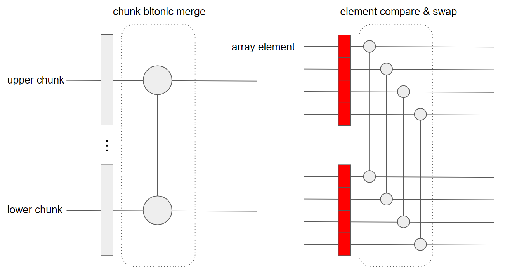
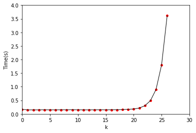

# Assignment 4 - Data-parallel Sorting using CUDA

Name : Tianxing Wang                                                                     

NetID : tw44

## Project Files

```
root directory
	├── bitonicSort.cu       // device code for bitonic sort
	├── main.cpp             // host code
	├── sortingNetworks_*    // provided code
	├── slurm-4026877.out    // slurm output file
	└── Makefile             // Makefile
```


## Algorithm

In this assignment, we need to implement bitonic sort for an array of unsigned integers with length of $ N=2^k, k\in[0,26] $ . 

For the situation of $ k \le 20 $, the array can be fit into the GPU memory, thus using the provided code to do an internal bitonic sorting (function `bitonicSort()`) by loading the whole array into the GPU device at once. In `bitonicSort()`, if the array length can be fit into the shared memory of a block, then call `bitonicSortShared` to do a complete bitonic sort in one block of shared memory(modify the original code to deal with $k\le10$ ); if the array cannot fit into shared memory, call `bitonicSortShared1()` to sort the even/odd subarray into the same direction to ensure botinicity. Then call `bitonicMergeGlobal()` to do merge the $stride \ge SHARED\_SIZE\_LIMIT$. Call `bitonicMergeShared`to merge the $stride \le \frac{SHARED\_SIZE\_LIMIT}{2}  $.

For the situation of $ k \textgreater 20 $, the array cannot fit into the GPU memory at once, an external bitonic sort should be utilized. To better illustrate the algorithm, given the instance of $ k = 2^k=2^{23} = 2^3\times2^{20}=8\times GPU Memory$ as shown in the picture below. Divide the array into chunks with the size of half of GPU memory. The GPU can fit in 2 chunks at once. In this way, the array can be divided into 16 chunks. 


Define an operation of Chunk Bitonic Merge with parameter `M` for chunk number (`CBM[M]`). A `CBM[M]` involves `M` chunks, as shown circled rectangle in the graph above. At each `CBM[M]` phase on the whole array, group the chunks into $ \frac{2^{(k+1)-20}}{M} $ groups, each group operate a `CBM[M]`. The group index is annotated as `group0, group1...` in the picture.

For `CBM[2] `, namely, pair the adjacent chunks and do a normal bitonic sort, as shown in the nodes of blue color. Alternate the sort directions every time. After this step, the first two chunks are in ascending order, the next two chunks are in descending order, and so on. The increase/decrease feature is annotated by +/-.

For `M>2`, the dashed line divides the `CBM[M]` into different steps. The rightmost step is the same as `CBM[2]` of pair-wise bitonic sorting. For each step on the left part annotated as nodes of color gray, operate a chunk bitonic merge on the upper chunk and lower chunk, which is an element-wise compare and swap operation. This part is identical to function `bitonicMergeGlobal()`, the stride exceeds the length of 2 chunks.



The `ValidateSortedKeys()` function validates the correctness of the sorted array. It will first check if the array length is too short (only one element) and verify all elements are less than the upper bound (65536 in the program). Then utilize a histogram counting to check the same occurrence of each value in the source array and the sorted result array. At last, do an array iteration to compare the elements pair-by-pair check if consist with ascending/descending. If it passes all tests will print `OK`, otherwise error information.

## GPU Resource Utilization

If the array length is greater than $SHARED\_SIZE\_LIMIT=1024U$, it will use 512 threads on the whole shared memory of one block. The number of thread blocks running on GPU is $2^{k-10}$.

In the program, I only construct a grid of one dimension, the maximum blocks on the one dimension is $2^{16}-1$. If $k=26$, all blocks will be occupied. Whether the program deploys all multiprocessors depends on the number of processors involve with blocks.

The shared memory has higher bandwidth and lower latency than global and local memory. So that should use shared memory as much as possible to reduce the data transfer between global memory and local memory. 

## Experiment

Submit job with parameter $0 \le k \le 26 $, plot with program collapse time:



While $k\le20$ the time is about the same, since the array can be loaded into the GPU one round; while $k \textgreater 20$, the time consumption grows nearly exponentially with `k`.

In the slurm output file, for all 26 parameters `k`, the validating function prints `OK`.
