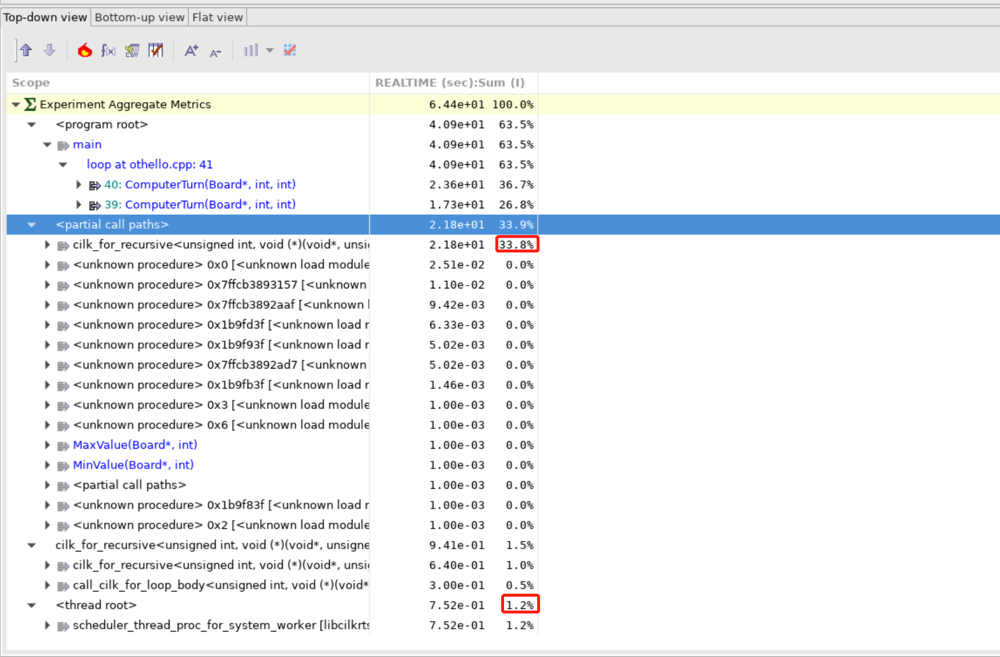
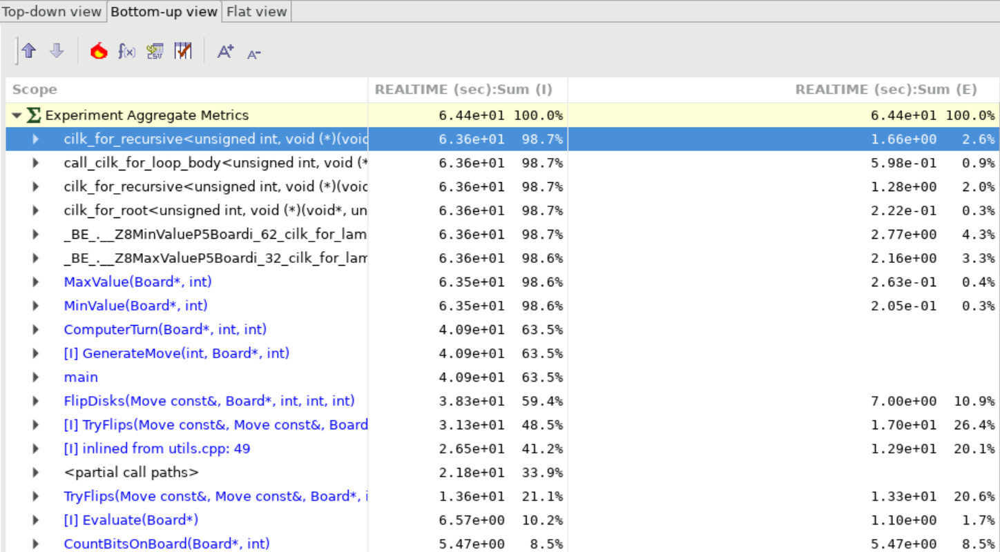
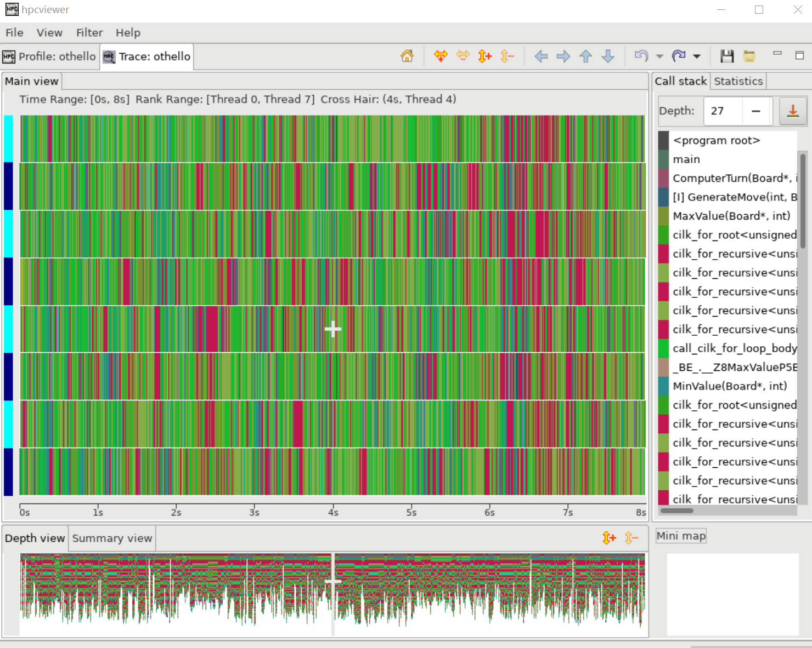
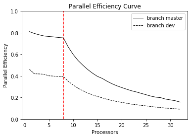

# Assignment 1: Parallel Exploratory Search


## Project Files 

```
root directory
	├── utils.h .cpp         // APIs for game interaction
	├── computer.h .cpp      // Computer player
	├── othello.cpp          // Main function to start the game
	├── serial.sh            // compile and submit serial job on private node
	├── parallel.sh          // compile and submit parallel job on private node
	├── view.sh              // compile and run cilkview and save output in file
	├── screen.sh            // compile and run cilkscreen and save output in file
	├── hpcgenerate.sh       // generate hpc dataset
	├── hpcviewer.sh         // launch hpcviewer
	├── plot.ipynb           // jupyter notebook to plot figures
	└── Makefile             // Makefile
```

## Algorithm Design & Implementation

### [Minimax](http://en.wikipedia.org/wiki/Minimax) with Cilk

Minimax is an algorithm for adversarial search. In Othello, two players play a deterministic and zero-sum game by taking moves in turn (unless no legal move). The `Estimation` of board configuration is simply the X's number subtract by O's number. At each node of X/O searching next best move using `MaxValue()`/`MinValue()` to maximize/minimize the estimation. Utilize `cilk_for` to iterate rows and columns of the board to find valid move, then recursively call `MinValue()`/`MaxValue()` for next layer best move searching. Early stop if both players cannot move.

```python
Value MaxValue(Board, depth, prev_moved):
    if depth > 0:
        --depth
        cilk::reducer_max<Value> best_move  // use reducer_max to find max value move
        cilk_for i from 1 to 8:
            for/cilk_for j from 1 to 8:
                move = {i, j}
                if move is valid:
                    nextBoard = MakeMove(m, Board)
                    best_move.calc_max(MinValue(next_Board, depth, true))
        if best_move:
            return best_move
        if prev_moved:
            return MinValue(next_Board, depth, false)
    return Estimate(Board)
```

```python
Value MinValue(Board, depth, prev_moved):
    if depth > 0:
        --depth
        cilk::reducer_min<Value> best_move  // use reducer_min to find min value move
        cilk_for i from 1 to 8:
            for/cilk_for j from 1 to 8:
                move = {i, j}
                if move is valid:
                    nextBoard = MakeMove(m, Board)
                    best_move.calc_min(MaxValue(next_Board, depth, true))
        if best_move:
            return best_move
        if prev_moved:
            return MaxValue(next_Board, depth, false)
    return Estimate(Board)
```

The previous pseudo-code is the description of `Master` branch code. Branch `dev` changes the inner loop to `cilk_for` to explore columns in spawns.

### Deterministic Policy

For the minimax algorithm, there are frequent circumstances that at one game tree node, there is multiple optimal actions with the same evaluation value. If we choose a random action among those equally optimal actions, the game tree exploration can vary at every execution. We have to make the policy deterministic, so that with the same game setting (the depth of each player), no matter how the other hyperparameters vary (program executes serial or parallel with a different number of workers), the game tree exploration remains the same.

Therefore, I define a struct `Value` to record the evaluation value and the move action correspondingly. For move actions with the same evaluation value, choose the one with overloaded comparison `operator` result of their move. The method is as below, which guarantees two different moves with the same estimation value can be compared.

`cilk::reducer_min` and `cilk::reducer_max` with template type `Value` can make a comparison with user-defined overloaded operator `<`.

```c++
typedef struct Move {
  int row = 0;
  int col = 0;
  /* constructors */
  bool operator < (const Move& other) const {
    if (row == other.row) {
      return col < other.col;
    }
    return row < other.row;
  }
} Move;
```

```c++
typedef struct Value {
    Move m;
    int value;
    /* constructors */
    bool operator < (const Value& other) const {
        if (value == other.value) {
            return m < other.m;
        }
        return value < other.value;
    }
} Value;
```

To determine if the exploration is the same, for a given depth, the move sequence and final board configuration should be the same. All my 4 `git` branches under serial or parallel execution output are the same as checked by `git diff`, which validates my deterministic policy explore the same search space. Thus the parallel experiment has the same baseline for comparison.


## Experiment

### Cilkscreen

Use script `screen.sh` to inspect the program, output in file `cilkscreen` indicated no data races error found.

### Cilkview

Use script `view.sh depth`, save the output in the file indicating depth, `cilkview.1`, `cilkview.2`, ..., `cilkview.7`.

| Depth                         | 1    | 2    | 3    | 4    | 5    | 6    | 7   |
| ----------------------------- | ---- | ---- | ---- | ---- | ---- | ---- | ---- |
| Work                          | 1,007k | 6,604k | 77,281k | 658,926k | 9,030,162k | 34,204,683k | 471,676,139k |
| Span                          | 357k | 1,007k | 4,320k | 10,525k | 27,706k | 47,724k | 324,939k |
| Burdened span                 | 5,818k | 20,600k | 81,526k | 203,198k | 536,369k | 941,618k | 6,067,293k |
| Parallelism      | 2.82 | 6.55 | 17.89 | 62.60 | 325.93 | 716.72 | 1451.58 |
| Burdened parallelism          | 0.17 | 0.32 | 0.95 | 3.24 | 16.84 | 36.33 | 77.74 |
| Number of spawns/syncs        | 496 | 3,576 | 33,776 | 281,784 | 3,594,624 | 14,445,320 | 181,084,792 |
| Average instructions / strand | 676 | 615 | 762 | 779 | 837 | 789 | 868 |
| Strands along span | 248 | 824 | 3,104 | 7,916 | 20,376 | 36,548 | 227,388 |
| Average instructions / strand on span | 1,440 | 1,212 | 1,391 | 1,329 | 1,359 |1,305|1,429|
| Total number of atomic instructions | 802    | 3,889 | 34,089 | 282,097 | 3,594,937 |14,445,627|181,085,099|
| Frame count | 992 | 7,535 | 71,710 | 598,727 | 7,638,512 |30,696,243|384,805,121|
| Entries to parallel region | 62 | 64 | 64 | 64 | 64 |62|62|

### HPCToolkit

Use `hpcgenerate.sh` to generate database for HPCToolkit. Configure X11 server on laptop then use `hpcviewer.sh` to show GUI.

The majority time cost is on main function, only `1.2%` at scheduler.






For each player's turn, there is a recursive function (`MaxValue`or `MinValue`) that spawns. `MaxValue`and `MinValue` takes the most time as shown on screenshots.



### Parallel Efficiency

Use `parallel.sh` to submit parallel jobs on the private node with parallel from 1 to 32, record time for different thread configuration.

| Threads | Real(s) | User(s) | Sys(s) |
| ------- | ------- | ------- | ------ |
| 1       | 58.245  | 58.062  | 0.094  |
| 2       | 29.732  | 59.354  | 0.090  |
| 3       | 20.147  | 60.154  | 0.269  |
| 4       | 15.319  | 61.048  | 0.186  |
| 5       | 12.332  | 61.416  | 0.199  |
| 6       | 10.332  | 61.733  | 0.130  |
| 7       | 8.916   | 2.067   | 0.150  |
| 8       | 7.843   | 61.982  | 0.176  |
| 9       | 7.857   | 62.191  | 0.215  |
| 10      | 7.876   | 62.281  | 0.319  |
| 11      | 7.899   | 62.336  | 0.326  |
| 12      | 7.877   | 62.286  | 0.267  |
| 13      | 7.907   | 62.348  | 0.397  |
| 14      | 7.935   | 62.249  | 0.355  |
| 15      | 7.954   | 61.948  | 0.423  |
| 16      | 7.835   | 61.851  | 0.602  |
| 17      | 7.932   | 62.153  | 0.945  |
| 18      | 8.010   | 62.350  | 1.284  |
| 19      | 8.062   | 62.579  | 1.621  |
| 20      | 8.077   | 62.616  | 1.740  |
| 21      | 8.116   | 62.645  | 1.947  |
| 22      | 8.180   | 62.966  | 2.248  |
| 23      | 8.164   | 62.811  | 2.249  |
| 24      | 8.256   | 63.036  | 2.779  |
| 25      | 8.365   | 3.283   | 3.349  |
| 26      | 8.536   | 3.712   | 4.246  |
| 27      | 8.609   | 3.91    | 4.675  |
| 28      | 8.493   | 3.627   | 4.027  |
| 29      | 8.780   | 4.296   | 5.324  |
| 30      | 8.854   | 4.622   | 5.532  |
| 31      | 8.947   | 4.573   | 6.683  |
| 32      | 9.384   | 8.004   | 6.806  |

Use `serial.sh`to submit `othello-serial` to a private node, the real time is `47.166s`. Parallel efficiency is computed as 
$$
\frac{S}{p * T(p)}
$$
Where `S = 47.166s`, *T(p)* is the real time of the execution on *p* processors.



Two curves with depth 7 are relatively flat between `[1, 8]`, which indicates good scalability. After worker number exceeds 8, the execution time does not decrease. `dev` has more spawn than `master` but performs worse.

At each computer player's move of `ComputerTurn`, parallel computing is applied and synchronized then the main thread call on the next `ComputerTurn`. When I set `depth=8` for both players, the curve is the same attribute as described before, execution time stop dropping after threads number exceeds 8. For a search at one decision node, 8 threads are enough for spawning at each row of the board, because the main thread waits for all threads return value then returns.

