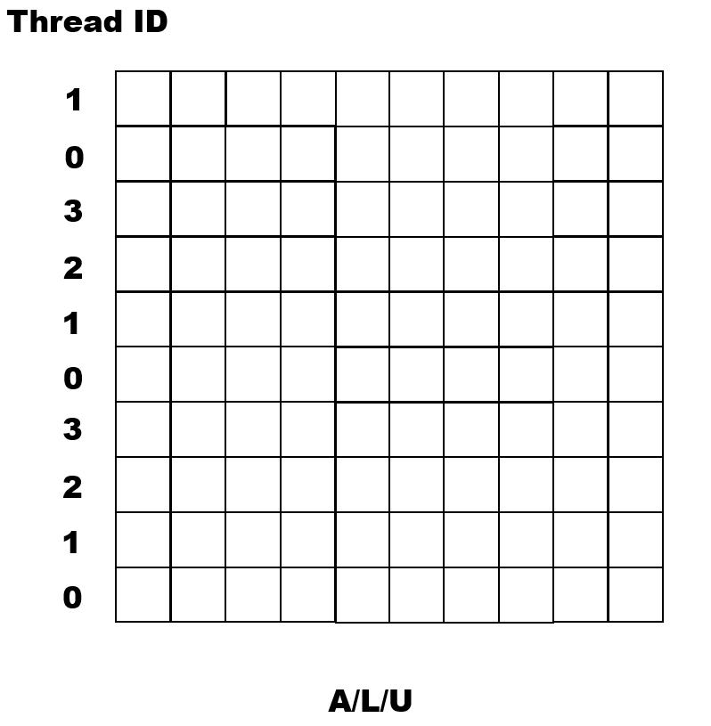
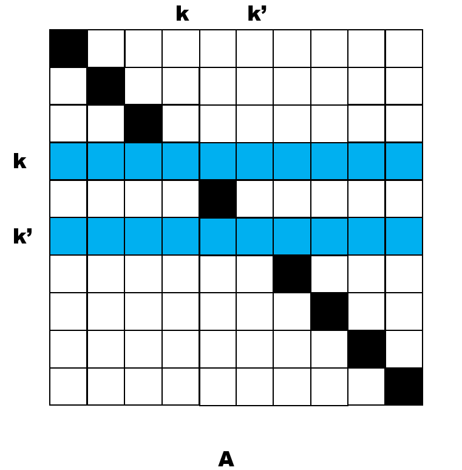
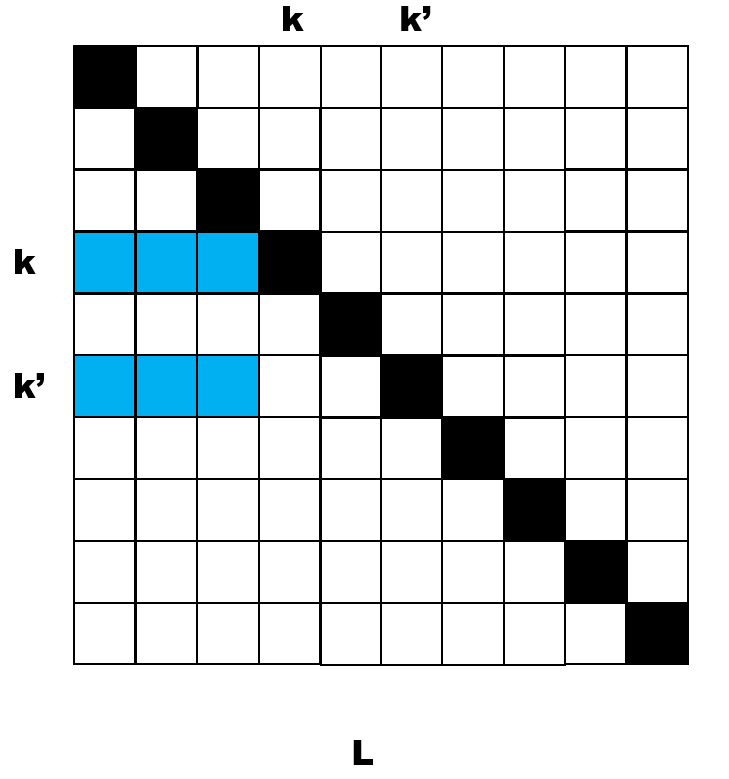
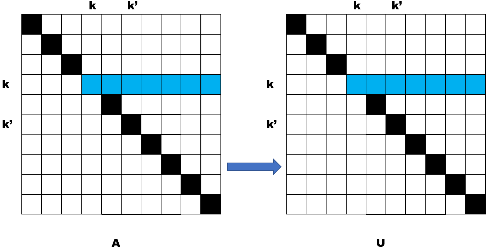
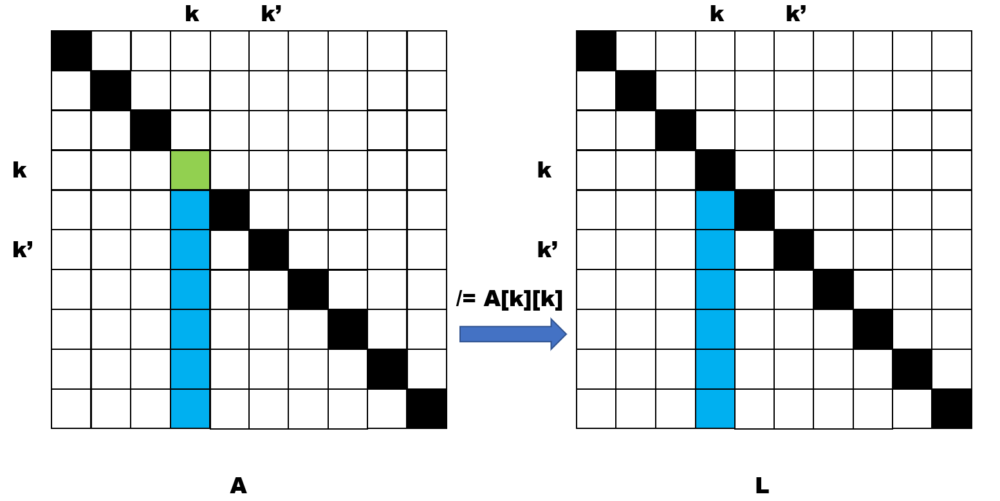
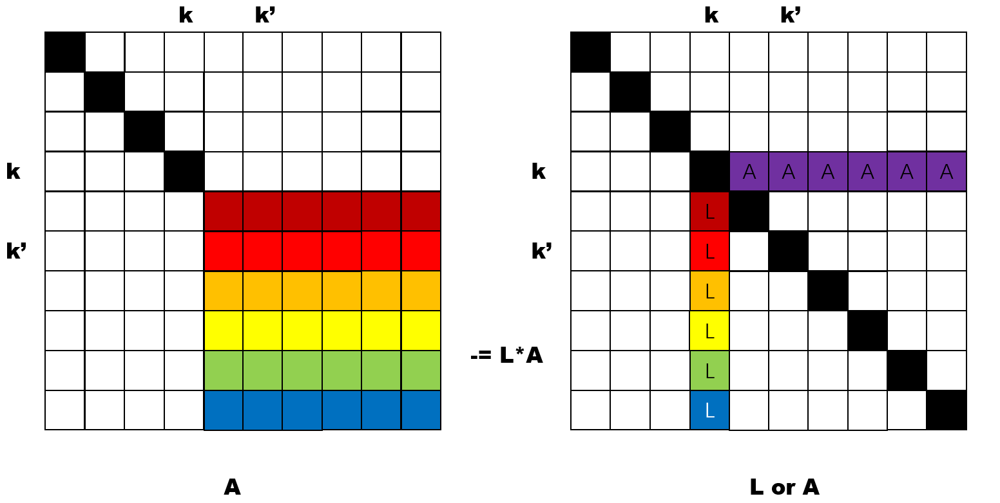
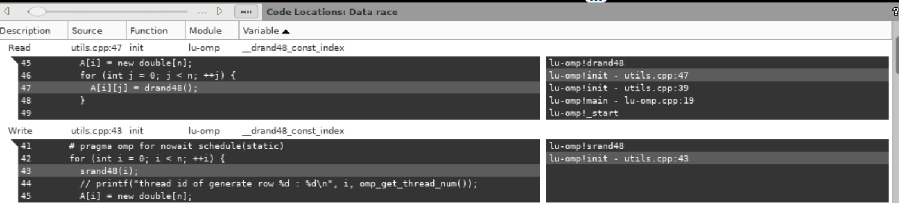
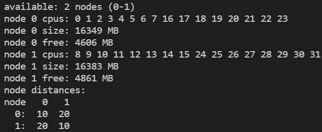
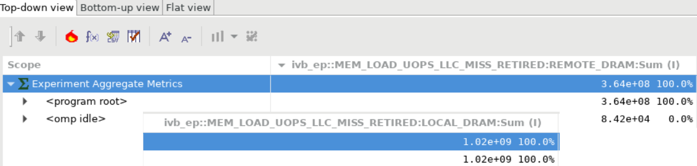
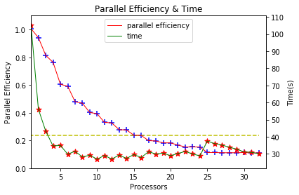

# Assignment 2 - Parallel LU Decomposition

Name : Tianxing Wang                                                                     

NetID : tw44

## Project Files

```
root directory
	├── utils.h .cpp         // APIs for log and L,12 norm validator
	├── lu-omp.cpp           // Main function and LU 
	├── serial.sh            // compile and submit serial job on compute node
	├── parallel.sh          // compile and submit parallel job on compute node
	├── submit.sh            // compile and submit.batch on compute node
	├── hpcgenerate.sh       // generate hpc dataset
	├── hpcviewer.sh         // launch hpcviewer
	├── plot.ipynb           // jupyter notebook to plot figures
	└── Makefile             // Makefile
```


## Algorithm Design & Implementation

### Data Partition

In the program, there are three computing data, namely the matrix A, L, and U with the same size n * n. Use data type `double** A = new double*[n]` to present each row of a matrix. In the row data allocation and initialization phase, use `omp for` to iterate over rows. Set the schedule clause of `schedule static(1)`, and each thread allocates its row with `numa_alloc_local`, the code snip is like below:

```c++
# pragma omp parallel for schedule(static, 1) 
for (int i = n - 1; i >= 0; --i) {
	A[i] = (double*)numa_alloc_local(sizeof(double) * n);
}
```

Under the  `static(1)` clause, the program assigns each iteration from beginning to end in a round-robin way to each thread. If the iteration `i` decrease from `n - 1` to `0`, the row to the thread id assigned this row is like the graph below if 4 thread in total:



My purpose is to write a program with the best locality possible, namely, all threads access the data through its CPU socket instead of fetching from another node. Threads use `void *numa_alloc_local(size_t size)` to allocate the row, which will allocate in the memory that this thread belongs to. 

### Parallelism Exploit & Synchronization

In the pseudo-code provided, the outer loop is impossible to parallel because of the swap operation over the row of  `A`. The parallel can only be done in each iteration on the column of `A`, and synchronized at the end of each iteration.

In each iteration at column index `k`, there are four steps:

### 1 Find maximum column k' and swap(A[k], A[k'])

Find the maximum value of in the column `k` under row `k` as `k'`, then swap `A[k]` with `A[k']`. This step should be guaranteed done prior to other steps beginning. I tried to use a `omp reduction` to parallel the process of locating the maximum value column, but the difference is so trivial compared to the heavy compute of the other parts.



A omp parallel region can be created to cover the steps 2 ~ 4 below:

### 2 swap(L[k, :k], L[k’, :k])

This step can be done in a `omp single` assigned to one thread.



### 3 assign A[k, k:] to U[k, k:]

This step can be done in a `omp single` assigned to one thread.




### 4 `assign A[k:, k] / A[k][k] to L[k:, k]` then `A[i][j] -= L[i][k] * U[k][j]`

In this step, the colored rows of A  from index `k + 1` to `n` are updated. For each row `i`, the pixel with the same row index and column index `k` at matrix `L`, namely `L[i][k]` paint as the same color with its corresponding row in `A`. Multiply `L[i][k]` with every element in the row segment `A[k][k+1:]` colored as purple in the graph, and subtract the product array to the A row by row. 





This step is the most workload in one iteration. Use an `omp for` to iterate over rows. The code snip is like:

```c++
# pragma omp for nowait schedule(static, 1)
for (int i = n - 1; i > k; --i) {
    L[i][k] = (A[i][k] / A[k][k]);
    for (int j = k + 1; j < n; ++j) {
    	A[i][j] -= L[i][k] * A[k][j];
    }
}
```

Notice that the loop from `n - 1` down to `k + 1`, which starts from `n - 1` just like the allocation phrase. The thread assignment in this loop will be the same as the allocation loop. The access of `L[i][k]` will be local and  `A[i]` will be local access if not swapped from a row allocated on another node ( in step 1 ). 

```c++
    # pragma omp parallel
    {
      // step 2 : swap(L[k, :k], L[k’, :k])
      # pragma omp single nowait
        ...

      // step 3 : assign A[k, k:] to U[k, k:]
      # pragma omp single nowait
        ...

      // step 4 : assign A[k:, k] / A[k][k] to L[k:, k] then
      // A[i][j] -= L[i][k] * U[k][j], i and j in [k + 1, n]
      # pragma omp for nowait schedule(static, 1)
        ...
    }
```


## Experiment

### Program Correctness & Data Races

Print out the `L2,1` norm of `PA - LU`, for a serial or parallel version of code, give arbitrary matrix size, the normalization is always 0 in the at least 6 digits after zero points.  

Run `check.sh` to check the data races with **Intel tools**, a data races problem reported. Use `view.sh` to check with Intel's Inspector GUI.



It seems a false alert, there will not be a data race condition, the correction check of computing normalization can confirm it.

### Manage Threads and Data on NOTS

Run command `numactl --hardware`to see the NUMA information of a compute node.



A compute node has 2 CPU sockets, a CPU node has 16 GB memory (32 GB in total). Node access to its memory distance is 10, across nodes is 20. In previous parts, I have demonstrated how to optimize in terms of NUMA. Use the helper function to print out the `omp_get_thread_num `, `sched_getcpu` and `numa_node_of_cpu` testified the runtime situation is as I expected.

### HPCToolKit Detect for Remote DRAM



Run `hpcgenerate.sh` to generate database, use two events of `ivb_ep::MEM_LOAD_UOPS_LLC_MISS_RETIRED:REMOTE_DRAM` and ` ivb_ep::MEM_LOAD_UOPS_LLC_MISS_RETIRED:LOCAL_DRAM` to report the remote DRAM fetch. Calculate the ratio of remote fetch is:

$$
\frac{remote}{remote + local} = \frac{3.64 * 10^{8}}{3.64 * 10^{8} + 1.02 * 10^{9}}=26.3\%
$$

## Parallel Efficiency

Use `parallel.sh` to submit parallel jobs on a compute node with parallel from 1 to 32, record time for different thread configuration.

Use `serial.sh`to submit `lu-omp-serial` to a private node, the real time is `105.815s`. Parallel efficiency is computed as 

$$
\frac{S}{p * T(p)}
$$

Where `S = 105.815s`, *T(p)* is the real time of the execution on *p* processors.

| Processors | Time    | Efficiency | Processors | Time   | Efficiency |
| ---------- | ------- | ---------- | ---------- | ------ | ---------- |
| 1          | 105.150 | 1.00       | 17         | 31.256 | 0.19       |
| 2          | 56.162  | 0.94       | 18         | 29.939 | 0.19       |
| 3          | 43.324  | 0.81       | 19         | 30.451 | 0.18       |
| 4          | 34.645  | 0.76       | 20         | 28.944 | 0.18       |
| 5          | 34.946  | 0.60       | 21         | 30.232 | 0.16       |
| 6          | 29.850  | 0.59       | 22         | 31.412 | 0.15       |
| 7          | 31.528  | 0.47       | 23         | 29.989 | 0.15       |
| 8          | 28.239  | 0.46       | 24         | 28.839 | 0.15       |
| 9          | 29.246  | 0.40       | 25         | 37.471 | 0.11       |
| 10         | 26.935  | 0.39       | 26         | 36.014 | 0.11       |
| 11         | 29.082  | 0.33       | 27         | 35.171 | 0.11       |
| 12         | 27.008  | 0.32       | 28         | 33.887 | 0.11       |
| 13         | 29.315  | 0.27       | 29         | 32.788 | 0.11       |
| 14         | 27.377  | 0.27       | 30         | 31.169 | 0.11       |
| 15         | 29.623  | 0.23       | 31         | 30.935 | 0.11       |
| 16         | 27.910  | 0.23       | 32         | 30.122 | 0.10       |




The parallel efficiency at `processors=16` is `23.7%`.
